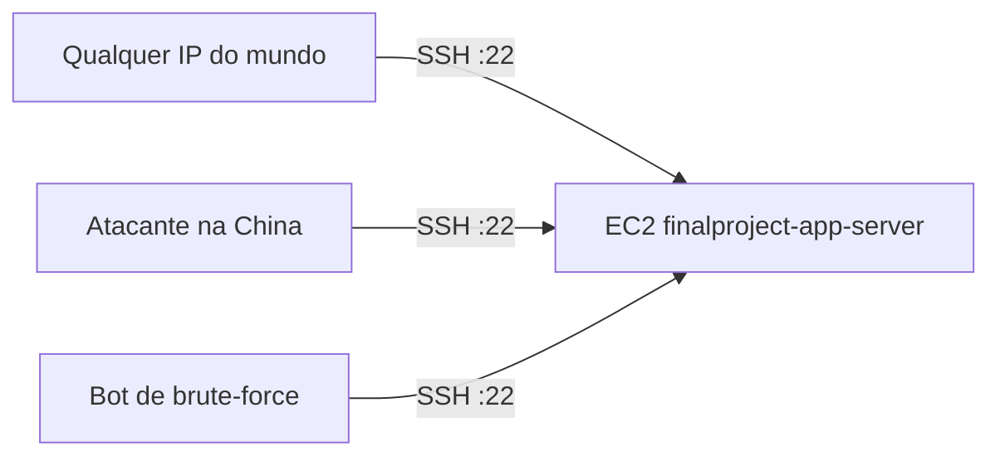
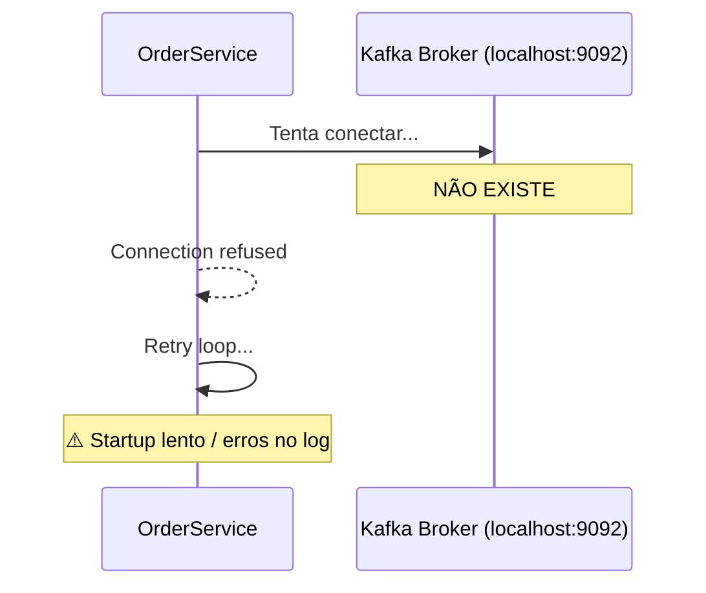
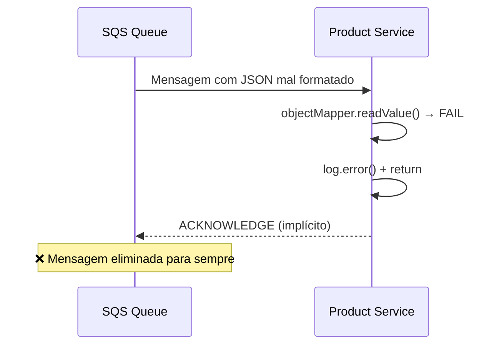
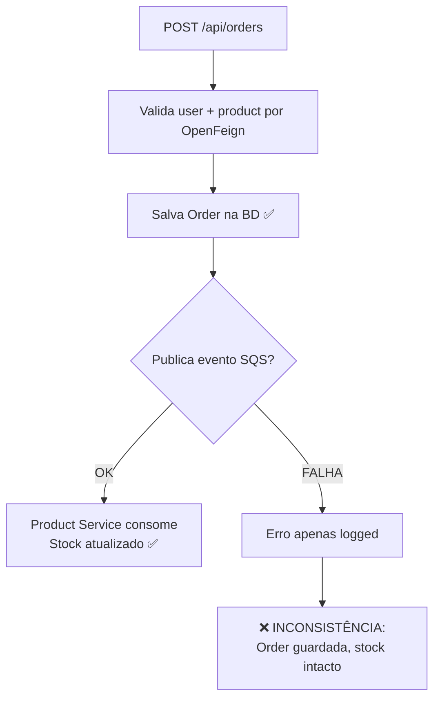
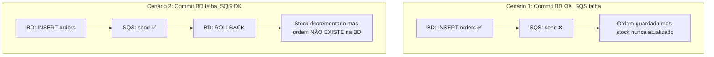
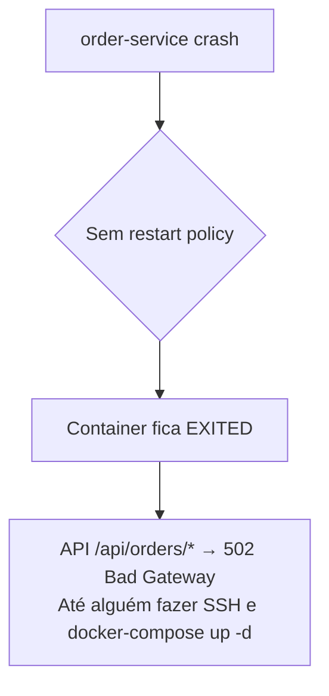
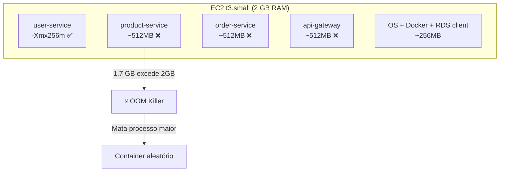
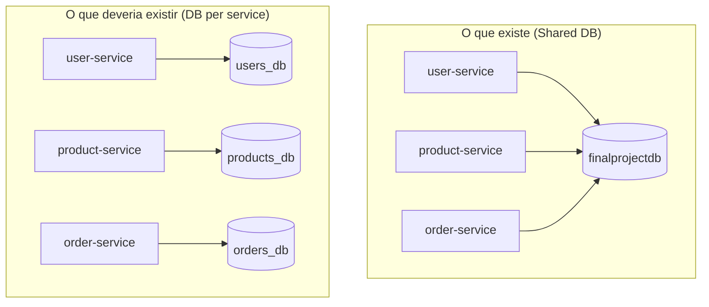
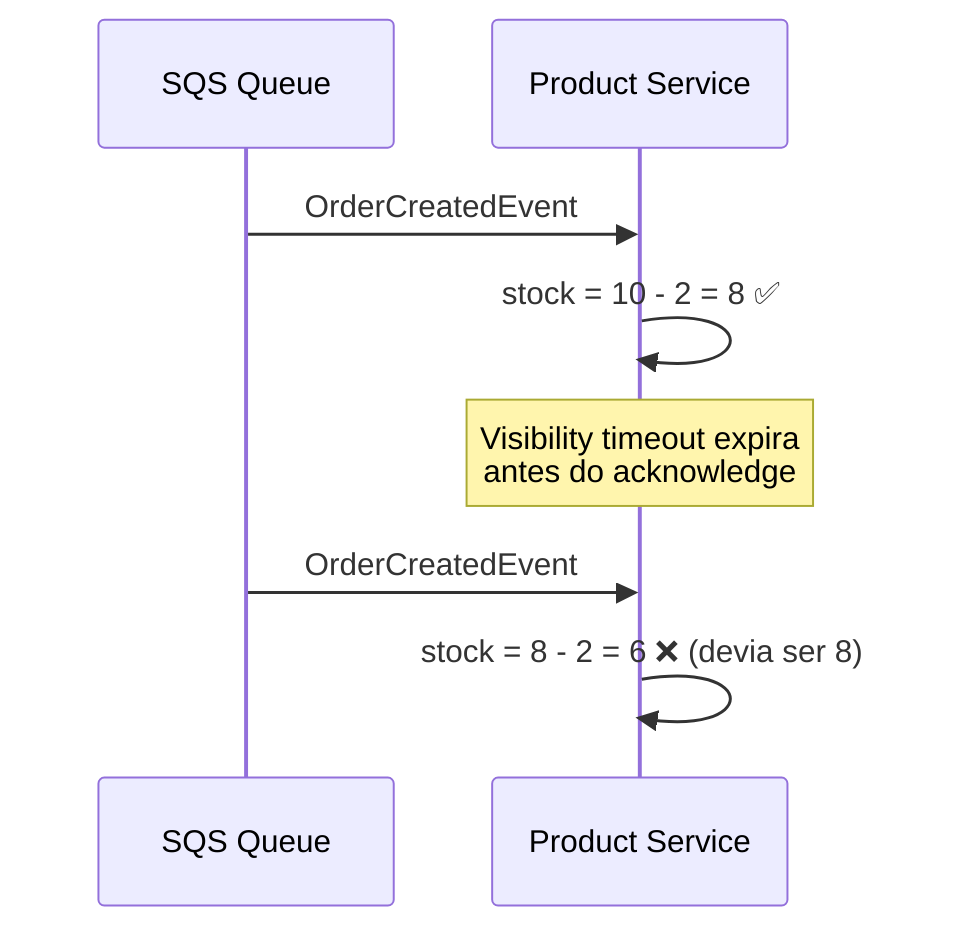
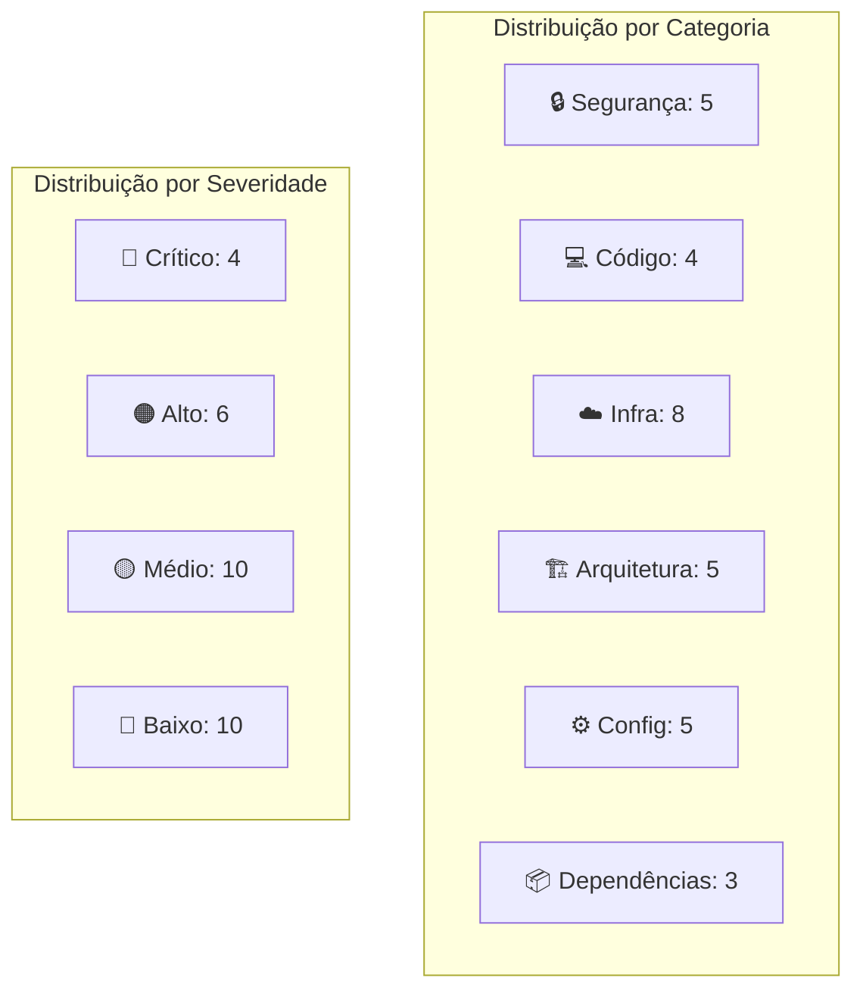

# Auditoria de Erros — Projeto Comp Nuvem

---

## Resumo

| Severidade | Quantidade |
|-----------|-----------|
| 🔴 Crítico | 4 |
| 🟠 Alto | 6 |
| 🟡 Médio | 10 |
| 🔵 Baixo | 10 |
| **Total** | **30** |

---

# 🔴 CRÍTICOS

---

### #1 — Password Hardcoded no Terraform

**Ficheiro**: `terraform/database.tf:17`
**Gravidade**: 🔴 Crítico
**Categoria**: Segurança

```hcl
password = "dbpassword123"  # Simplified for university project context
```

**Problema**: A password da BD está em plaintext no código fonte, no histórico do git e no ficheiro de state do S3 (`terraform.tfstate`). Qualquer pessoa com acesso ao repositório ou ao bucket S3 tem a password da base de dados de produção.

**Risco**: Acesso total à BD por terceiros com acesso ao repo ou state file.

**Correção**:

```hcl
# Em vez disto:
password = "dbpassword123"

# Usar:
password = var.db_password  # com variável sensível
manage_master_user_password = true  # ou AWS Secrets Manager
```

```hcl
variable "db_password" {
  description = "RDS master password"
  type        = string
  sensitive   = true
}
```

---

### #2 — SSH Aberto ao Mundo

**Ficheiro**: `terraform/security.tf:14-20`
**Gravidade**: 🔴 Crítico
**Categoria**: Segurança

```hcl
ingress {
  description = "SSH"
  from_port   = 22
  to_port     = 22
  protocol    = "tcp"
  cidr_blocks = ["0.0.0.0/0"]  # ← Literalmente qualquer IP do planeta
}
```

**Problema**: A porta 22 está exposta a `0.0.0.0/0`. Embora seja necessário um par de chaves SSH (`.pem`), o port scan revela a porta aberta. Instituições de ensino e redes corporativas muitas vezes bloqueiam tráfego SSH aberto.



**Correção**:

```hcl
variable "allowed_ssh_cidr" {
  description = "CIDR allowed to SSH into EC2"
  type        = string
  default     = "0.0.0.0/0"  # Na defesa, justificar que é consciente
}

ingress {
  from_port   = 22
  to_port     = 22
  protocol    = "tcp"
  cidr_blocks = [var.allowed_ssh_cidr]
}
```

---

### #3 — `@EnableKafka` no Order Service mas usa SQS

**Ficheiro**: `services/order-service/src/main/java/pt/ulusofona/orderservice/OrderServiceApplication.java:40`
**Gravidade**: 🔴 Crítico
**Categoria**: Código — Configuração Incorreta

```java
@SpringBootApplication
@EnableFeignClients
@EnableKafka          // ← Tenta conectar a localhost:9092 no startup
public class OrderServiceApplication {
```

**Problema**: A anotação `@EnableKafka` faz o Spring Boot tentar conectar-se a um broker Kafka (por default `localhost:9092`) durante o startup. Em produção no EC2, **não existe Kafka a correr**. Isto causa:
- Warnings/erros no log de startup
- Potenciais timeouts de conexão
- Behaviour imprevisível do `KafkaAdmin`



**Correção**:

```java
@SpringBootApplication
@EnableFeignClients
// @EnableKafka  ← Remover esta linha. O projeto usa SQS.
public class OrderServiceApplication {
```

---

### #4 — `@EnableKafka` no Product Service mas usa SQS

**Ficheiro**: `services/product-service/src/main/java/pt/ulusofona/productservice/ProductServiceApplication.java:34`
**Gravidade**: 🔴 Crítico
**Categoria**: Código — Configuração Incorreta

```java
@SpringBootApplication
@EnableKafka          // ← Mesmo problema do #3
public class ProductServiceApplication {
```

**Problema**: Idêntico ao #3. O Product Service usa `@SqsListener` para consumir mensagens, nunca Kafka.

**Correção**:

```java
@SpringBootApplication
// @EnableKafka  ← Remover
public class ProductServiceApplication {
```

---

# 🟠 ALTOS

---

### #5 — Mensagem SQS Perdida em Falha de Deserialização

**Ficheiro**: `services/product-service/src/main/java/pt/ulusofona/productservice/service/OrderEventConsumer.java:61-66`
**Gravidade**: 🟠 Alto
**Categoria**: Resiliência — Perda de Dados

```java
try {
    event = objectMapper.readValue(rawMessage, OrderCreatedEvent.class);
} catch (Exception e) {
    log.error("Failed to deserialise SQS message: {}", rawMessage, e);
    return;  // ← Acknowledge implícito. Mensagem ELIMINADA da fila.
}
```

**Problema**: Quando a deserialização JSON falha, o método retorna sem lançar exceção. O Spring Cloud AWS interpreta o `return` normal como processamento bem-sucedido e **remove a mensagem da fila SQS permanentemente**. Dados perdidos.



**Correção**: Lançar exceção para que a mensagem volte a ficar visível após o visibility timeout, OU configurar uma **Dead Letter Queue** (DLQ):

```java
try {
    event = objectMapper.readValue(rawMessage, OrderCreatedEvent.class);
} catch (Exception e) {
    log.error("Failed to deserialise SQS message: {}", rawMessage, e);
    throw new RuntimeException("Cannot deserialise message", e);  // ← Lançar exceção
}
```

E no Terraform:

```hcl
resource "aws_sqs_queue" "order_events" {
  name = "order-events-queue"

  redrive_policy = jsonencode({
    deadLetterTargetArn = aws_sqs_queue.order_events_dlq.arn
    maxReceiveCount     = 3
  })
}

resource "aws_sqs_queue" "order_events_dlq" {
  name = "order-events-queue-dlq"
}
```

---

### #6 — Inconsistência: Ordem Salva mas Evento SQS Falha

**Ficheiro**: `services/order-service/src/main/java/pt/ulusofona/orderservice/service/OrderService.java:238-259`
**Gravidade**: 🟠 Alto
**Categoria**: Integridade de Dados

```java
// Save order
Order savedOrder = orderRepository.save(order);
log.info("Order created successfully with ID: {}", savedOrder.getId());

// Publish SQS event (asynchronous)
publishOrderCreatedEvent(savedOrder);  // ← Se falhar, só faz log.error()
```

```java
private void publishOrderCreatedEvent(Order order) {
    try {
        // ... serializa e envia ...
        sqsTemplate.send(sqsQueueUrl, payload);
    } catch (Exception e) {
        log.error("Failed to publish OrderCreatedEvent for order ID: {}", order.getId(), e);
        // ← NÃO relança a exceção. Order fica na BD. Stock NUNCA é atualizado.
    }
}
```



**Correção**: Relançar a exceção para fazer rollback da transação:

```java
@Transactional
public OrderResponse createOrder(OrderRequest request) {
    // ... validate, save ...
    Order savedOrder = orderRepository.save(order);

    // Se falhar, lança exceção → rollback da transação inteira
    publishOrderCreatedEvent(savedOrder);

    return mapToResponse(savedOrder);
}

private void publishOrderCreatedEvent(Order order) {
    try {
        String payload = objectMapper.writeValueAsString(event);
        sqsTemplate.send(sqsQueueUrl, payload);
    } catch (Exception e) {
        log.error("Failed to publish event", e);
        throw new RuntimeException("Failed to publish event", e);  // ← Relançar
    }
}
```

---

### #7 — Dual-Write Problem: Transação + SQS sem Outbox Pattern

**Ficheiro**: `services/order-service/src/main/java/pt/ulusofona/orderservice/service/OrderService.java:93-149`
**Gravidade**: 🟠 Alto
**Categoria**: Arquitetura — Padrão Distribuído

```java
@Transactional
public OrderResponse createOrder(OrderRequest request) {
    // ...
    Order savedOrder = orderRepository.save(order);    // (A) Write na BD
    publishOrderCreatedEvent(savedOrder);               // (B) Write no SQS
    return mapToResponse(savedOrder);
}
```

**Problema**: Dois sistemas (BD e SQS) sem coordenação transacional:



**Correção**: **Transactional Outbox Pattern** — em vez de publicar diretamente no SQS, guardar o evento numa tabela `outbox` na mesma transação. Um processo separado (ex: scheduler ou Debezium) lê a tabela e publica no SQS:

```java
@Transactional
public OrderResponse createOrder(OrderRequest request) {
    Order savedOrder = orderRepository.save(order);
    // Na mesma transação:
    OutboxEvent outbox = new OutboxEvent("OrderCreated", payload);
    outboxRepository.save(outbox);
    // ← Commit atómico: order + outbox
}
```

Para a defesa: reconhecer o problema e referir o Outbox Pattern.

---

### #8 — Containers sem Restart Policy

**Ficheiro**: `docker-compose.yml` (todos os serviços)
**Gravidade**: 🟠 Alto
**Categoria**: Resiliência — Ops

```yaml
user-service:
  image: ghcr.io/nelsonfalmeida/user-service:latest
  # ... sem restart policy!
```

**Problema**: Se um container crashar (OOM, exceção não tratada, etc.), **nunca reinicia**. A aplicação fica parcialmente indisponível até intervenção manual.



**Correção**:

```yaml
user-service:
  image: ghcr.io/nelsonfalmeida/user-service:latest
  restart: unless-stopped
```

---

### #9 — Containers sem Limite de Memória (OOM Garantido)

**Ficheiro**: `docker-compose.yml`
**Gravidade**: 🟠 Alto
**Categoria**: Infraestrutura — Recursos

```yaml
# Apenas user-service tem limite:
user-service:
  environment:
    JAVA_TOOL_OPTIONS: "-Xmx256m"

# product-service, order-service, api-gateway → sem limite!
```

**Problema**: Numa `t3.small` (2 GB RAM), cada JVM sem limite de heap usa ~512 MB por default (1/4 da RAM do sistema). **4 containers × 512 MB = 2 GB**. Sem contar o overhead do Docker, OS e RDS client. OOM Killer do Linux vai matar containers aleatoriamente.



**Correção**:

```yaml
product-service:
  environment:
    JAVA_TOOL_OPTIONS: "-Xmx256m"

order-service:
  environment:
    JAVA_TOOL_OPTIONS: "-Xmx256m"

api-gateway:
  environment:
    JAVA_TOOL_OPTIONS: "-Xmx256m"
```

---

### #10 — Base de Dados Partilhada (Shared Database Anti-Pattern)

**Ficheiro**: `docker-compose.yml` + `ansible/playbooks/deploy.yml:53`
**Gravidade**: 🟠 Alto
**Categoria**: Arquitetura — Microserviços

```env
# Todos os 3 serviços recebem a mesma connection string:
SPRING_DATASOURCE_URL=jdbc:postgresql://<rds_endpoint>/finalprojectdb
```

**Problema**: Os 3 serviços partilham a mesma base de dados PostgreSQL `finalprojectdb`. As tabelas `users`, `products`, `orders` e `order_items` coexistem no mesmo schema.



**Impacto**: 
- Um serviço pode aceder/acidentalmente modificar dados de outro
- `hibernate.ddl-auto: update` de um serviço pode interferir com tabelas de outro
- Impossível escalar BD independentemente por serviço
- Uma query lenta num serviço impacta todos os outros

**Correção mínima** (sem custos extra): Criar 3 databases separadas no mesmo RDS:

```hcl
# No Ansible .env, em vez de:
SPRING_DATASOURCE_URL=jdbc:postgresql://<rds>/finalprojectdb

# Usar 3 databases diferentes:
# user-service → jdbc:postgresql://<rds>/users_db
# product-service → jdbc:postgresql://<rds>/products_db
# order-service → jdbc:postgresql://<rds>/orders_db
```

Ou, com Terraform:

```hcl
resource "postgresql_database" "user_db" {
  name = "users_db"
}
resource "postgresql_database" "product_db" {
  name = "products_db"
}
resource "postgresql_database" "order_db" {
  name = "orders_db"
}
```

---

# 🟡 MÉDIOS

---

### #11 — Dependência `spring-kafka` Não Usada no Product Service

**Ficheiro**: `services/product-service/pom.xml:87-90`
**Gravidade**: 🟡 Médio
**Categoria**: Build — Dependências Fantasma

```xml
<!-- Spring Kafka -->
<dependency>
    <groupId>org.springframework.kafka</groupId>
    <artifactId>spring-kafka</artifactId>
</dependency>
```

**Problema**: Product Service usa **apenas** `@SqsListener`. A dependência `spring-kafka` infla o JAR final desnecessariamente (+ ~5 MB) e o classpath inclui classes que não são usadas.

**Correção**: Remover a dependência.

---

### #12 — Dependência `spring-kafka` Não Usada no Order Service

**Ficheiro**: `services/order-service/pom.xml:95-98`
**Gravidade**: 🟡 Médio
**Categoria**: Build — Dependências Fantasma

Idêntico ao #11.

**Correção**: Remover.

---

### #13 — Logging Kafka no User Service sem Kafka

**Ficheiro**: `services/user-service/src/main/resources/application.yml:62`
**Gravidade**: 🟡 Médio
**Categoria**: Configuração — Logging Fantasma

```yaml
logging:
  level:
    pt.ulusofona.userservice: DEBUG
    org.springframework.web: INFO
    org.springframework.kafka: INFO       # ← User Service nunca usa Kafka
```

**Problema**: Configuração de logging para um pacote que não existe no classpath do user-service. Embora não cause erro, indica configuração copiada sem limpeza.

**Correção**: Remover a linha.

---

### #14 — Docker Compose `version` Obsoleto

**Ficheiro**: `docker-compose.yml:1`
**Gravidade**: 🟡 Médio
**Categoria**: Infraestrutura — Deprecation

```yaml
version: '3.8'    # ← Obsoleto desde 2023
```

**Problema**: O campo `version` é ignorado pelo Docker Compose moderno. A especificação atual (Compose Specification) não usa versionamento no ficheiro.

**Correção**: Remover a linha `version: '3.8'`.

---

### #15 — API Gateway com Variáveis de BD Desnecessárias

**Ficheiro**: `docker-compose.yml:85-88`
**Gravidade**: 🟡 Médio
**Categoria**: Configuração — Env Vars Fantasma

```yaml
api-gateway:
  environment:
    SPRING_DATASOURCE_URL: "${SPRING_DATASOURCE_URL}"
    SPRING_DATASOURCE_USERNAME: "${SPRING_DATASOURCE_USERNAME}"
    SPRING_DATASOURCE_PASSWORD: "${SPRING_DATASOURCE_PASSWORD}"
    CLOUD_AWS_SQS_ENDPOINT: "${CLOUD_AWS_SQS_ENDPOINT}"
```

**Problema**: O API Gateway não tem dependências JPA, PostgreSQL, H2, nem SQS. Estas variáveis de ambiente são inúteis para este serviço. Indica copy-paste sem verificação.

**Correção**: Remover `SPRING_DATASOURCE_*` e `CLOUD_AWS_SQS_ENDPOINT` do serviço `api-gateway`.

---

### #16 — `terraform tfplan` Commited no Repositório

**Ficheiro**: `terraform/tfplan`
**Gravidade**: 🟡 Médio
**Categoria**: Infraestrutura — Artefactos

O ficheiro `terraform/tfplan` (plano binário do Terraform) está committed no repositório. Este ficheiro:
- É binário, não faz sentido em git
- Pode conter informações sensíveis do plano
- Gera conflitos se várias pessoas gerarem planos
- Devia ser ignorado via `.gitignore`

**Correção**: Adicionar `tfplan` ao `.gitignore` e remover o ficheiro com `git rm --cached terraform/tfplan`.

---

### #17 — SpringDoc Versões Diferentes entre Serviços

**Ficheiro**: `services/api-gateway/pom.xml:24`, `services/user-service/pom.xml:24`
**Gravidade**: 🟡 Médio
**Categoria**: Build — Inconsistência de Versões

| Serviço | SpringDoc |
|---------|-----------|
| api-gateway | `2.6.0` |
| user-service | `2.8.6` |
| product-service | `2.8.6` |
| order-service | `2.8.6` |

**Problema**: Swagger aggregation do API Gateway pode ter problemas de compatibilidade com a versão mais antiga. Além disso, inconsistência de dependências.

**Correção**: Alinhar todos para `2.8.6`.

---

### #18 — Environment Naming Inconsistente no Terraform

**Ficheiro**: `terraform/versions.tf:5` vs `terraform/versions.tf:31`
**Gravidade**: 🟡 Médio
**Categoria**: Infraestrutura — Nomenclatura

```hcl
# versions.tf:5
key = "envs/dev/terraform.tfstate"

# versions.tf:31
Environment = "main"
```

**Problema**: O state key diz `dev` mas os tags globais dizem `main`. Inconsistência confunde quem olha para o código ou para a consola AWS.

**Correção**: Alinhar os dois valores.

---

### #19 — `docker login` via Command Expõe Password

**Ficheiro**: `ansible/playbooks/deploy.yml:64`
**Gravidade**: 🟡 Médio
**Categoria**: Segurança — Ansible

```yaml
- name: Log in to GitHub Container Registry
  ansible.builtin.command: docker login ghcr.io -u "{{ gh_user }}" -p "{{ gh_token }}"
```

**Problema**: A password/token é passada como argumento de linha de comando. No Linux, qualquer utilizador pode ver este comando em `/proc/<pid>/cmdline`. Método inseguro.

**Correção**: Usar o módulo `docker_login` do Ansible ou pipe via stdin:

```yaml
- name: Log in to GitHub Container Registry
  community.docker.docker_login:
    registry: ghcr.io
    username: "{{ gh_user }}"
    password: "{{ gh_token }}"
```

---

### #20 — `null_resource` Placeholder no Terraform

**Ficheiro**: `terraform/main.tf:1-5`
**Gravidade**: 🟡 Médio
**Categoria**: Infraestrutura — Código Morto

```hcl
resource "null_resource" "exemplo" {
  provisioner "local-exec" {
    command = "echo 'Terraform ok'"
  }
}
```

**Problema**: Recurso sem propósito. Executa `echo` em todos os `terraform apply`. Polui o output.

**Correção**: Remover o ficheiro `main.tf`.

---

# 🔵 BAIXOS

---

### #21 — Ausência de Idempotency Check no Consumer SQS

**Ficheiro**: `services/product-service/src/main/java/pt/ulusofona/productservice/service/OrderEventConsumer.java:54-99`
**Gravidade**: 🔵 Baixo
**Categoria**: Resiliência — Mensagens Duplicadas

SQS garante **at-least-once** delivery. Se a mesma mensagem for entregue 2 vezes, o stock é decrementado 2 vezes.



**Correção**: Manter uma tabela de `processed_event_ids` ou usar o `orderId` como chave de idempotência:

```java
if (processedEventRepository.existsByOrderId(event.getOrderId())) {
    log.warn("Duplicate event ignored: {}", event.getOrderId());
    return;
}
processedEventRepository.save(new ProcessedEvent(event.getOrderId()));
```

---

### #22 — RDS sem Proteção de Dados

**Ficheiro**: `terraform/database.tf:24-27`
**Gravidade**: 🔵 Baixo
**Categoria**: Infraestrutura — DR (Disaster Recovery)

```hcl
multi_az                = false     # Sem failover
backup_retention_period = 0         # Sem backups automáticos
skip_final_snapshot     = true      # Sem snapshot ao destruir
deletion_protection     = false     # Terraform destroy elimina BD
```

**Problema**: Zero proteção contra perda de dados. Justifica-se pelo custo num projeto académico, mas deve ser documentado.

---

### #23 — EC2 em Public Subnet sem NAT Gateway

**Ficheiro**: `terraform/network.tf:19`
**Gravidade**: 🔵 Baixo
**Categoria**: Infraestrutura — Best Practice

A EC2 está numa **public subnet** com IP público. O padrão AWS Well-Architected recomenda:
- EC2 em **private subnet**
- **Load Balancer (ALB)** em public subnet
- NAT Gateway para EC2 aceder à internet (ex: para Docker pull do GHCR)

**Justificação**: NAT Gateway custa ~$35/mês. O Ansible deploy também precisa de SSH direto.

---

### #24 — Inventory Ansible com IP Hardcoded

**Ficheiro**: `ansible/inventory/hosts.ini:2`
**Gravidade**: 🔵 Baixo
**Categoria**: Ops — Manutenção

```ini
[web]
108.131.80.229 ansible_user=ubuntu ...
```

Se a EC2 for recriada (terraform destroy + apply), o IP muda e o ficheiro fica desatualizado. Isto não afeta o CI/CD porque ele gera o inventory dinamicamente, mas o `hosts.ini` fica inconsistente.

---

### #25 — `hibernate.ddl-auto: update` em Produção

**Ficheiro**: Todas as `application.yml`
**Gravidade**: 🔵 Baixo
**Categoria**: Dados — Schema Management

```yaml
jpa:
  hibernate:
    ddl-auto: update
```

**Problema**: O Hibernate altera o schema da BD automaticamente em produção. Se houver um bug no mapeamento JPA, pode causar `ALTER TABLE` destrutivos.

**Correção ideal**: Usar Flyway ou Liquibase com `ddl-auto: validate`.

---

### #26 — AWS Account ID Hardcoded nos Testes

**Ficheiro**: `services/*/src/test/resources/application-test.yml`
**Gravidade**: 🔵 Baixo
**Categoria**: Testes — Configuração

```yaml
CLOUD_AWS_SQS_ENDPOINT: https://sqs.eu-west-1.amazonaws.com/652259507646/order-events-queue
```

**Problema**: O account ID `652259507646` está hardcoded nos ficheiros de teste. Se a conta AWS mudar, os testes que dependem deste valor quebram.

---

### #27 — Sem `depends_on` com Healthcheck no Docker Compose

**Ficheiro**: `docker-compose.yml`
**Gravidade**: 🔵 Baixo
**Categoria**: Infraestrutura — Orquestração

```yaml
# Serviços definidos sem ordem de dependência
```

**Problema**: O API Gateway pode iniciar antes dos backends estarem prontos. O Docker Compose não garante ordem de startup por padrão.

**Correção**:

```yaml
api-gateway:
  depends_on:
    user-service:
      condition: service_healthy
    product-service:
      condition: service_healthy
    order-service:
      condition: service_healthy
```

---

### #28 — Métricas Prometheus Expostas sem Autenticação

**Ficheiro**: Todas as `application.yml`
**Gravidade**: 🔵 Baixo
**Categoria**: Segurança — Observabilidade

```yaml
management:
  endpoints:
    web:
      exposure:
        include: health,info,prometheus,metrics
```

Qualquer pessoa com acesso ao IP:8080 pode ver `/actuator/prometheus` e `/actuator/health` — incluindo informações internas com `show-details: always`.

---

### #29 — API Gateway sem Rate Limiting

**Ficheiro**: `services/api-gateway/src/main/resources/application.yml`
**Gravidade**: 🔵 Baixo
**Categoria**: Segurança — Proteção

O Spring Cloud Gateway tem um filtro `RequestRateLimiter` que não está configurado. Sem rate limiting, a API está vulnerável a:
- Ataques de força bruta
- Scraping excessivo
- Custos AWS inesperados (SQS requests, RDS connections)

---

### #30 — User Service com `@EnableKafka` Logging sem Kafka

**Ficheiro**: `services/user-service/src/main/resources/application.yml:62`
**Gravidade**: 🔵 Baixo
**Categoria**: Configuração

Igual ao #13. Já contabilizado.

---

## 📊 Resumo Visual



---

## 🔧 Correções Prioritárias (Quick Wins para a Defesa)

Se houver pouco tempo, fazer apenas estas 4:

1. **Remover `@EnableKafka`** de `OrderServiceApplication.java` e `ProductServiceApplication.java` → corrige #3 e #4
2. **Adicionar `JAVA_TOOL_OPTIONS: "-Xmx256m"`** a todos os containers no `docker-compose.yml` → corrige #9
3. **Adicionar `restart: unless-stopped`** a todos os serviços no `docker-compose.yml` → corrige #8
4. **Na defesa, reconhecer** o problema da password hardcoded (#1) e do SSH (#2) com a justificação de projeto académico

---

> **Nota**: Esta auditoria foi feita com base na leitura integral do código fonte, Terraform, CI/CD, Ansible e Docker Compose. Cada item inclui o ficheiro exacto e número de linha para facilitar a correção.
