# Guia de Defesa — Projeto Comp Nuvem

## Índice

1. [Arquitetura Geral](#1-arquitetura-geral)
2. [Organização da Infraestrutura](#2-organização-da-infraestrutura)
3. [Networking](#3-networking)
4. [Segurança](#4-segurança)
5. [Terraform](#5-terraform)
6. [CI/CD](#6-cicd)
7. [Estratégia de Deployment](#7-estratégia-de-deployment)
8. [Arquitetura Orientada a Eventos](#8-arquitetura-orientada-a-eventos)
9. [Desafios e Tradeoffs](#9-desafios-e-tradeoffs)
10. [Preparação para a Defesa](#10-preparação-para-a-defesa)

---

## 1. Arquitetura Geral

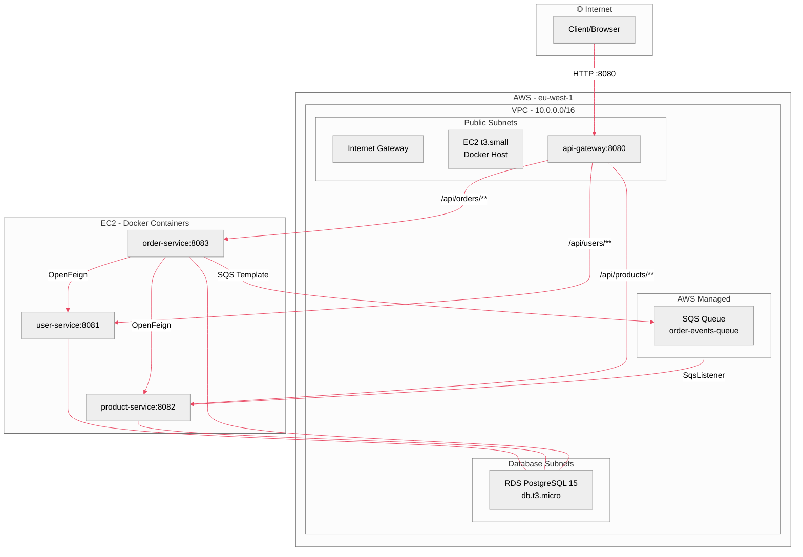

### Fluxo de Tráfego (Criação de Encomenda)

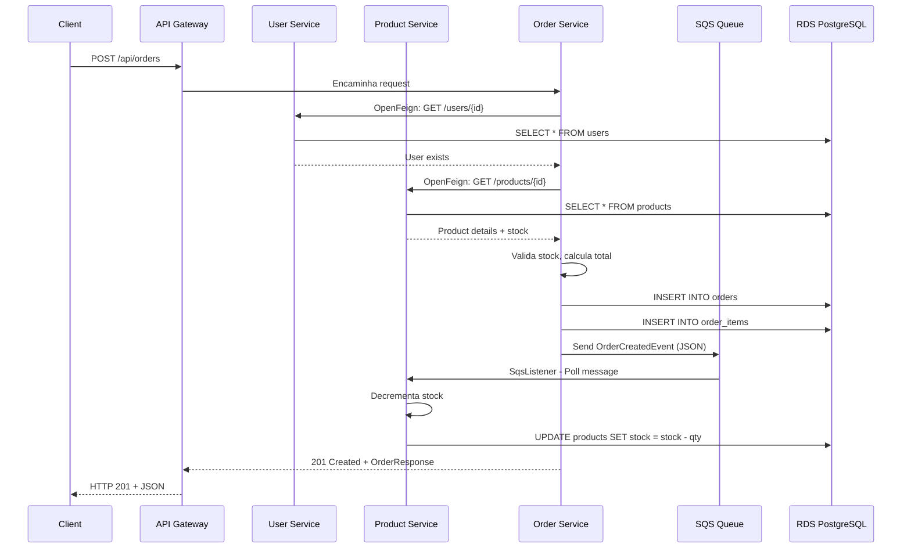

---

## 2. Organização da Infraestrutura

### Porque dividimos a VPC nestas subnets?

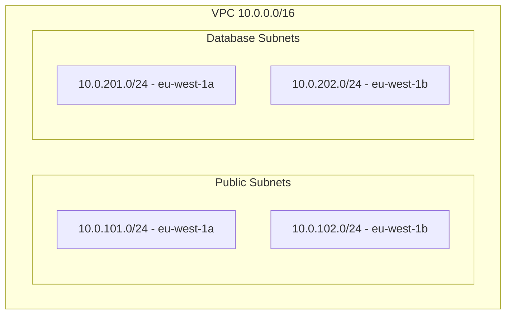

**Razão da divisão:**

- **Public Subnets** (`10.0.101.0/24`, `10.0.102.0/24`): Contêm a EC2 que precisa de acesso à Internet (recebe tráfego HTTP e permite SSH). O Internet Gateway está attached a estas subnets via route table.
- **Database Subnets** (`10.0.201.0/24`, `10.0.202.0/24`): Isoladas — não têm rota para o Internet Gateway. Apenas a EC2 (via security group) consegue aceder à porta 5432 do RDS.
- **2 AZs**: Garantimos alta disponibilidade a nível de subnets, mesmo que os recursos (RDS single-AZ, EC2 single) estejam apenas numa AZ.

### O que está na public vs private subnet?

| Subnet | Recurso | Justificação |
|--------|---------|-------------|
| **Public** | EC2 (app_server) | Precisa de IP público para servir a API e receber SSH para debugging/deployment |
| **Public** | Internet Gateway | Permite tráfego de entrada/saída da Internet |
| **Database** | RDS PostgreSQL | Nunca deve ter acesso direto à Internet. Só a EC2 comunica com ele |

### Como o RDS está isolado?

- Subnet em database subnets (sem Internet Gateway route)
- Security Group (`rds_sg`) permite **apenas** tráfego na porta 5432 vindo do security group da EC2 (`ec2_sg`)
- Nem sequer tem IP público associado

### Fluxo de tráfego Internet → Serviço

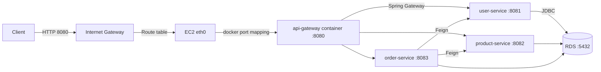

---

## 3. Networking

### Diagrama de Rede Completo

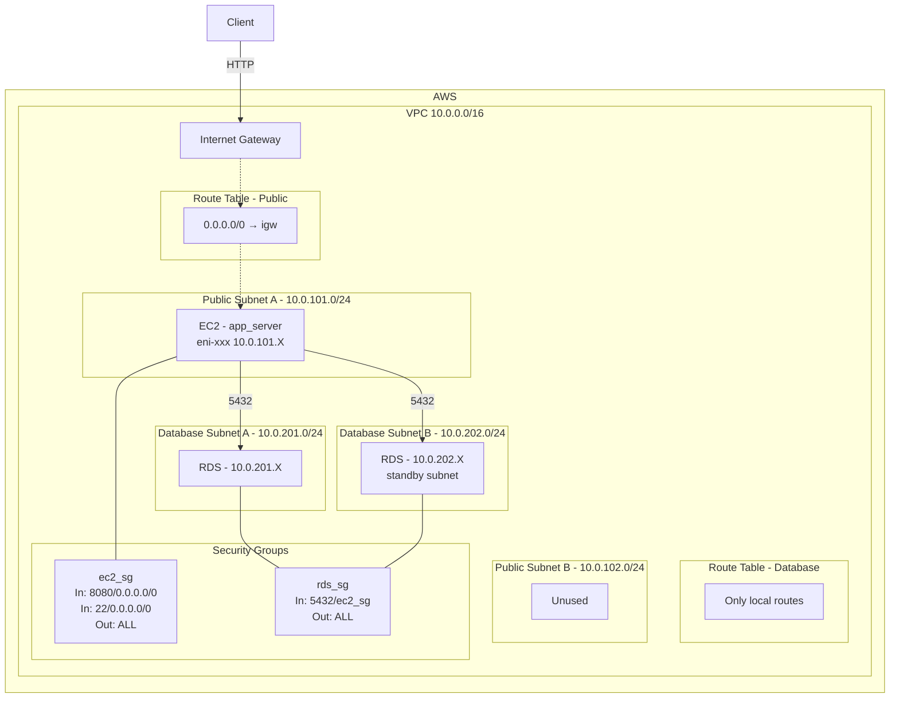

### Security Groups

| Security Group | Regras |
|----------------|--------|
| **ec2_sg** | Ingress: 8080 (API) de `0.0.0.0/0`, 22 (SSH) de `0.0.0.0/0` |
| **rds_sg** | Ingress: 5432 (PostgreSQL) **apenas** do `ec2_sg` |
| **Egress** | Ambos permitem todo o tráfego de saída |

---

## 4. Segurança

### IAM Roles

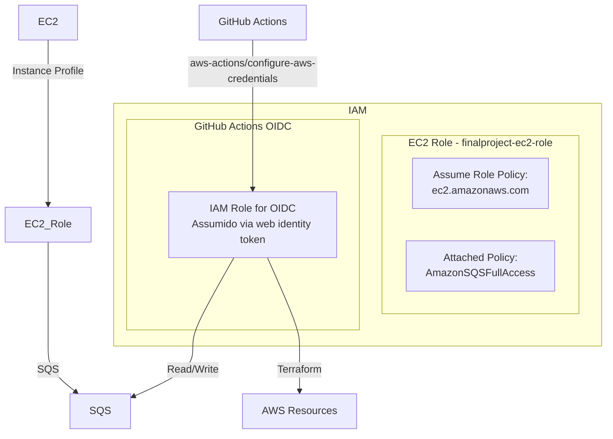

**EC2 IAM Role** (`finalproject-ec2-role`):
- **Trust policy**: `ec2.amazonaws.com` (só a EC2 pode assumir este role)
- **Permissions**: `AmazonSQSFullAccess` — permite ao Docker container enviar/receber mensagens SQS
- **Blast radius**: Se a EC2 for comprometida, o atacante consegue ler/escrever na SQS queue. **Não** tem acesso a RDS, EC2, ou outros recursos. A password da BD está no `.env` da EC2, logo o verdadeiro impacto é fuga de dados do SQS + acesso à BD.

### Onde estão os secrets?

| Secret | Localização |
|--------|-------------|
| `DB_PASSWORD` | GitHub Actions secret (`secrets.DB_PASSWORD`) |
| `EC2_SSH_KEY` | GitHub Actions secret |
| `AWS_ROLE_TO_ASSUME` | GitHub Actions secret |
| `GITHUB_TOKEN` | Gerado automaticamente pelo GitHub Actions |
| `.env` file | Gerado pelo Ansible na EC2 (`/opt/myproject/.env`), modo `0600` |

### Como prevenimos commits de secrets?

- `.gitignore` inclui `*.env`, `.env.local`, `*.tfvars`
- `*.tfstate` também está ignorado (pode conter passwords plaintext)
- A password do RDS está hardcoded no `database.tf` — **ponto fraco conhecido**, justificado como "projeto universitário"

### Blast radius se uma IAM key leak

| Chave | Impacto |
|-------|---------|
| **EC2 Role** | Acesso ao SQS queue + leaking de dados da BD (se aceder ao `.env` no filesystem) |
| **OIDC Role (GitHub)** | Capacidade de fazer `terraform apply` e criar/modificar toda a infraestrutura |

---

## 5. Terraform

### Estrutura de Módulos

```
terraform/
├── versions.tf      # Provider, backend, tags globais
├── main.tf          # Placeholder (null_resource)
├── network.tf       # VPC, subnets, route tables
├── compute.tf       # EC2 instance, AMI data source
├── database.tf      # RDS PostgreSQL
├── security.tf      # Security Groups, IAM Role + Policy
├── messaging.tf     # SQS Queue
└── outputs.tf       # ec2_public_ip, rds_endpoint, sqs_queue_url
```

### Porque esta granularidade?

Separámos por **domínio lógico** (network, compute, database, security, messaging) em vez de um único ficheiro monolítico. Isto permite:
1. **Legibilidade** — cada ficheiro tem uma responsabilidade única
2. **Manutenção** — alterações de segurança não tocam em networking
3. **Reutilização** — se um dia modularizarmos por serviço, a extração é trivial

### Onde está o state?

**S3 backend** (`versions.tf:4-10`):

```
bucket  = "finalproject-tf-state-eu-west-1"
key     = "envs/dev/terraform.tfstate"
dynamodb_table = "finalproject-tf-locks"
encrypt = true
```

- **S3**: State centralizado, acessível por toda a equipa/GitHub Actions
- **DynamoDB Locking**: Previne concorrência (duas pessoas a fazer `apply` ao mesmo tempo)
- **Encrypt=true**: Server-side encryption do state (protege passwords/secrets)
- **Key `envs/dev/`**: Estruturado para suportar múltiplos ambientes (dev/staging/prod)

### Como lidamos com diferenças de ambiente?

Atualmente só existe **main**. A estrutura está preparada para múltiplos ambientes via:
1. **Workspaces** do Terraform
2. **Separar ficheiros `.tfvars`** (ex: `dev.tfvars`, `prod.tfvars`)
3. **Key path no S3**: `envs/dev/`, `envs/prod/`

### Variáveis parametrizadas — exemplos

| Variável | Onde | Porquê |
|----------|------|--------|
| `instance_type` | `compute.tf` | `t3.small` — parametrizável para mudar de tamanho por ambiente |
| `db_password` | `database.tf` | Hardcoded (devia ser variável + secrets manager) |
| `CLOUD_AWS_SQS_ENDPOINT` | `application.yml` | Mudado por env var para apontar para a queue real em produção |
| `SPRING_DATASOURCE_URL` | `docker-compose.yml` | Injetado pelo Ansible com o endpoint real do RDS |

---

## 6. CI/CD

### Workflows

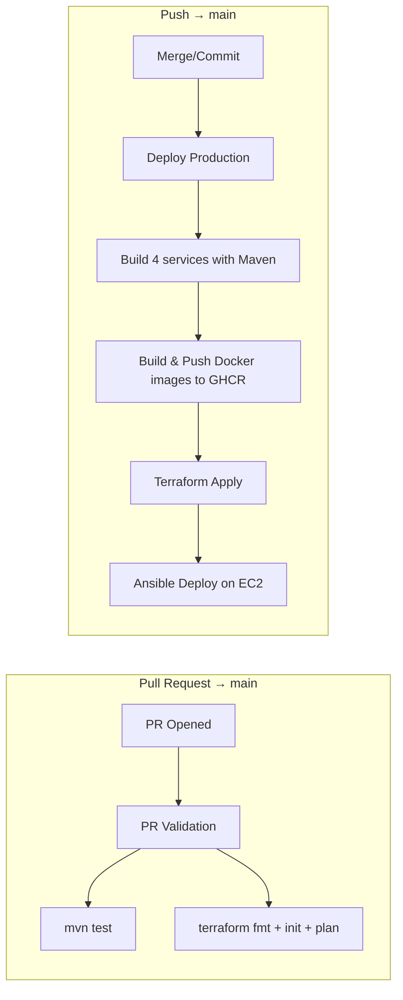

### Pipeline PR Validation

**Ficheiro**: `.github/workflows/pr-validation.yml`

| Job | Ações |
|-----|-------|
| `test-code` | `mvn -B clean test` (todos os microserviços com JaCoCo) |
| `terraform-plan` (needs: test-code) | `terraform fmt -check` + `init` + `plan` |

### Pipeline Deploy Production

**Ficheiro**: `.github/workflows/deploy-production.yml`

| Job (sequencial) | Ações |
|------------------|-------|
| `build-and-push` (matrix: 4 services) | `mvn package` → `docker build` → push para `ghcr.io/nelsonfalmeida/*` |
| `terraform-apply` (needs: build-and-push) | `terraform init` + `apply`, captura `ec2_public_ip`, `rds_endpoint`, `sqs_queue_url` |
| `ansible-deploy` (needs: terraform-apply) | Instala Ansible, escreve SSH key, cria inventory dinâmico, executa `ansible-playbook deploy.yml` |

### Como a pipeline autentica na AWS?

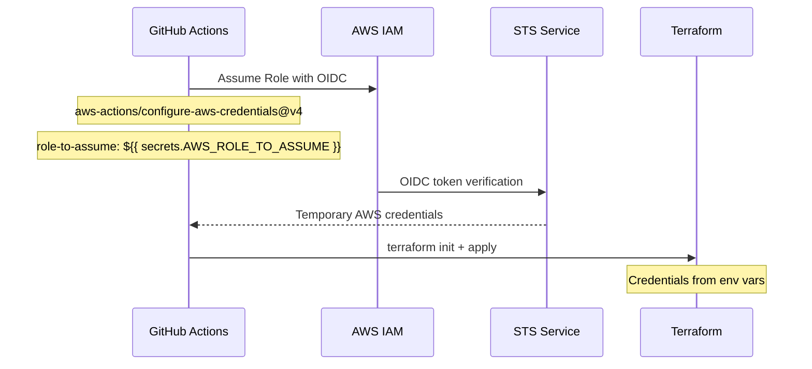

Usamos **OIDC** (OpenID Connect) — **não há Access Keys estáticas**. O GitHub Actions pede um token temporário à AWS via `aws-actions/configure-aws-credentials`. O IAM Role tem uma trust policy que só aceita tokens do repositório `nelsonfalmeida/comp_nuvem` no branch `main`.

### O que acontece em PR vs merge em main?

| Evento | Ações | Propósito |
|--------|-------|-----------|
| **PR aberto** | `mvn test` + `terraform plan` | Validar código e ver impacto infra sem aplicar |
| **Merge em main** | Build + docker push + terraform apply + ansible | Deploy automático para produção |

### Como protegemos produção de um bad deploy?

1. **PR Validation obrigatório**: O `terraform plan` falha se houver erros de sintaxe/IaC
2. **Testes unitários**: `mvn test` com JaCoCo (85% coverage mínima) previne código quebrado
3. **Separação de jobs no deploy**: `build-and-push` → `terraform-apply` → `ansible-deploy`. Se build falhar, terraform não corre
4. **Imagens com SHA**: `docker build -t ...:latest -t ...:${{ github.sha }}` permite rollback para uma versão específica
5. **Ansible**: `docker-compose up -d --remove-orphans` — se algo falhar, os contentores anteriores continuam a correr

---

## 7. Estratégia de Deployment

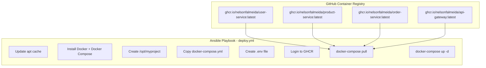

**Estratégia**: **Image-based deployment**:
1. GitHub Actions compila, faz build e push das imagens Docker para GHCR
2. Terraform garante que a infraestrutura existe (EC2, RDS, SQS)
3. Ansible conecta-se à EC2 via SSH, copia o `docker-compose.yml`, cria `.env` com as variáveis de ambiente corretas (RDS endpoint, SQS URL, passwords), faz login no GHCR, faz pull das imagens `latest`, e faz `docker-compose up -d`

**Rollback**: Para reverter, fazemos push de uma versão anterior ou usamos o SHA da imagem anterior:
```bash
docker pull ghcr.io/nelsonfalmeida/user-service:<sha-anterior>
docker tag ghcr.io/nelsonfalmeida/user-service:<sha-anterior> ghcr.io/nelsonfalmeida/user-service:latest
ansible-playbook ...
```

---

## 8. Arquitetura Orientada a Eventos

### Porque SQS?

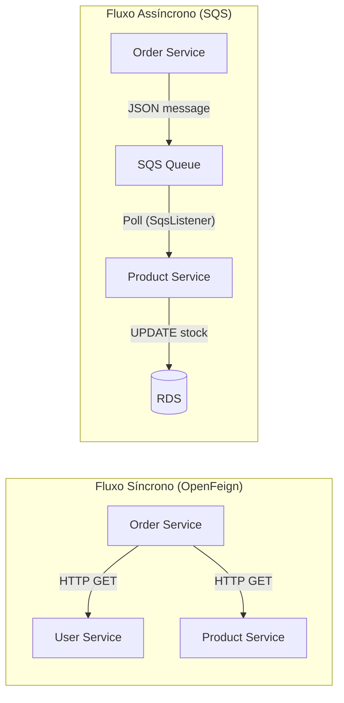

**Porquê SQS em vez de Kafka?**

| Critério | SQS | Kafka |
|----------|-----|-------|
| **Setup** | Zero — AWS managed, sem necessidade de configurar brokers | Requer cluster Zookeeper + brokers |
| **Custo** | Pay-per-use | Custo fixo de instância EC2/broker |
| **Integração Spring** | `spring-cloud-aws-starter-sqs` | `spring-kafka` |
| **Garantias** | At-least-once delivery | At-least-once / Exactly-once |
| **Retenção** | Até 14 dias | Configurável (dias/semanas) |
| **Dead Letter Queue** | Nativo (configurável) | Requer configuração manual |

Para um **projeto universitário**, SQS é a escolha pragmática:
- Não precisamos de gerir servidores Kafka
- Custo zero se a fila estiver vazia
- Mais simples de configurar com Spring Cloud AWS

### O que acontece se o consumer crash a meio?

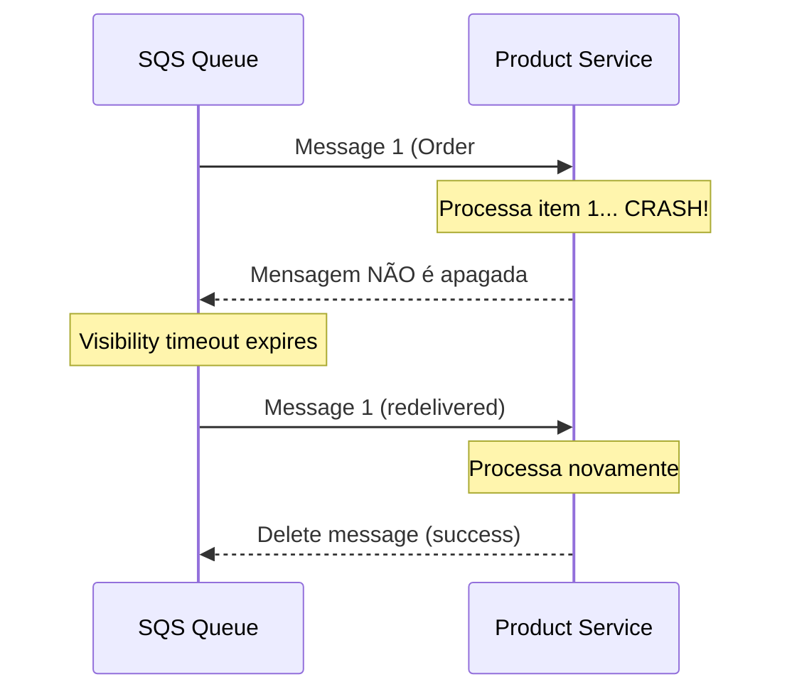

O SQS usa **visibility timeout** (default 30s). Se o consumer crash:
1. A mensagem **não é apagada** da fila
2. Após o visibility timeout, a mensagem fica visível novamente
3. Outro consumer (ou o mesmo após restart) recebe a mensagem

**Cuidado**: Como é "at-least-once", podemos processar a mesma mensagem duas vezes. O código do `OrderEventConsumer` salta items com stock insuficiente (`continue`), mas não tem idempotency checks completos.

### Substituir SQS por HTTP síncrono — o que perdemos?

| Perda | Impacto |
|-------|---------|
| **Resiliência** | Se Product Service estiver em baixo, a criação de ordem falha totalmente |
| **Desacoplamento temporal** | Com HTTP, ambos os serviços têm de estar online. Com SQS, a ordem é criada e o stock é atualizado quando o Product Service recuperar |
| **Escalabilidade** | HTTP pressure o servidor. SQS pode bufferizar milhares de mensagens |
| **Tolerância a picos** | SQS funciona como amortecedor (traffic smoothing) |

**O que ganhamos com HTTP síncrono**:
- Consistência imediata (stock atualizado no momento da ordem)
- Menos complexidade (sem fila, sem polling, sem serialização de mensagens)
- Feedback instantâneo ao cliente

### Como o sistema lida com falhas parciais?

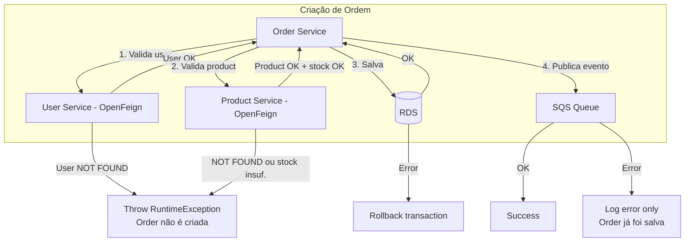

1. **Falha OpenFeign**: Se User ou Product Service estão em baixo, a ordem não é criada → `RuntimeException`
2. **Stock insuficiente**: Exceção lançada antes de salvar a ordem
3. **Falha de BD**: `@Transactional` faz rollback automático
4. **Falha SQS**: Ordem é salva, mas o evento não é publicado. A falha é apenas logada — **inconsistência potencial** (stock não é atualizado)

---

## 9. Desafios e Tradeoffs

### O que simplificámos e porquê?

| Decisão | Simplificação | Justificação |
|---------|---------------|-------------|
| **Sem NAT Gateway** | A EC2 usa subnets públicas diretamente | Poupança de ~$35/mês |
| **RDS Single-AZ** | Sem failover automático | Redução de custos para ~50% |
| **Password hardcoded no Terraform** | `password = "dbpassword123"` | Projeto académico — senão teríamos de usar AWS Secrets Manager |
| **SQS sem DLQ** | Mensagens mal formatadas são ignoradas (log + return) | Não implementámos dead letter queue por simplicidade |
| **Terraform num único diretório** | Sem modules separados | Suficiente para o scope do projeto |
| **Ansible inventory estático** | IP fixo no `hosts.ini` | Em produção, deveria ser dinâmico via `add_host` ou AWS EC2 plugin |

### O que faríamos diferente com mais 2 semanas?

1. **AWS Secrets Manager** para a password da BD (em vez de hardcoded)
2. **Terraform modules** para cada microserviço (user-infra, product-infra, order-infra)
3. **Auto-scaling group** para a EC2 com load balancer
4. **RDS Multi-AZ** com backups automáticos
5. **DLQ (Dead Letter Queue)** para mensagens SQS que falham
6. **Idempotency checks** no OrderEventConsumer para prevenir duplicados
7. **GitHub Environments** com aprovação manual para produção
8. **Testes de integração** com Testcontainers (SQS, PostgreSQL)

### A parte mais difícil

| Desafio | Descrição | Solução |
|---------|-----------|---------|
| **Transição Kafka → SQS** | O README diz que usa Kafka, mas o código real usa SQS (referências misturadas) | Adaptámos o código para SQS com `spring-cloud-aws-starter-sqs`, mantendo OpenFeign para sync |
| **Configuração de ambiente** | Diferentes valores para local (H2) vs produção (RDS) | Usámos env vars com fallback via `${VAR:default}` no `application.yml` |
| **Pipeline OIDC + Terraform + Ansible** | Coordenar três jobs com dependências e outputs | Usámos `needs` + `outputs` no GitHub Actions para passar IP/endpoints entre jobs |
| **Docker networking** | Containers precisam de comunicar entre si (Feign) e com AWS (SQS, RDS) | Rede Docker bridge + env vars com service names (`http://user-service:8081`) |

---

## 10. Preparação para a Defesa

### Checklist

- [ ] Percorrer o repositório em equipa — ninguém deve ser surpreendido pelo próprio código
- [ ] Ter a AWS Console aberta num separador e ensaiar um walkthrough de 5 minutos
- [ ] Ter um vídeo de backup do demo funcional (caso o live demo falhe)
- [ ] Praticar a explicação dos diagramas em voz alta
- [ ] Ser honesto sobre limitações — "não tivemos tempo para X, eis como abordaríamos" é melhor que fingir que funciona
- [ ] Dividir o tempo de fala igualmente pelo grupo

### Respostas Rápidas

**Porque dividiram a VPC nestas subnets?**
> Separámos o tráfego público (EC2, Internet Gateway) do tráfego de dados (RDS). As database subnets não têm rota para o Internet Gateway, isolando a BD.

**O que está na public vs private subnet?**
> EC2 e Internet Gateway nas public subnets. RDS nas database subnets (sem acesso à Internet).

**Como o RDS está isolado?**
> Security Group que só permite tráfego do security group da EC2 na porta 5432. Sem IP público. Subnets sem Internet Gateway.

**Como o tráfego flui da Internet para o serviço?**
> Client → API Gateway (8080) → Internet Gateway → EC2 → Docker containers. O API Gateway faz reverse proxy para os serviços internos.

**Walkthrough da estrutura de módulos Terraform?**
> Ficheiros separados por domínio lógico: network, compute, database, security, messaging. State no S3 com DynamoDB lock.

**Onde está o state e porquê?**
> S3 bucket `finalproject-tf-state-eu-west-1`, com DynamoDB para locking. Centralizado para a equipa e CI/CD acederem.

**Como lidam com diferenças de ambiente?**
> Env vars com fallback no `application.yml`. O Ansible injeta os valores reais de produção via `.env`. A estrutura do S3 (`envs/dev/`) está preparada para multi-ambiente.

**Mostrem uma variável parametrizada.**
> `SPRING_DATASOURCE_URL` — tem valor default H2 para dev local, mas em produção é substituída via env var pelo endpoint RDS. Isto permite correr localmente sem dependências AWS.

**Mostrem um workflow run real.**
> [Abrir GitHub Actions no repositório e mostrar um run de sucesso]

**Como a pipeline autentica na AWS?**
> OIDC (OpenID Connect) — sem access keys estáticas. O GitHub Actions assume um IAM Role via token temporário.

**O que acontece em PR vs merge em main?**
> PR: `mvn test` + `terraform plan`. Merge: build + push + terraform apply + ansible deploy.

**Como protegem produção de um bad deploy?**
> PR validation obrigatório, testes com JaCoCo (85% coverage), jobs sequenciais com `needs`, imagens versionadas com SHA.

**Porque SQS em vez de Kafka?**
> Zero setup, custo pay-per-use, mais simples com Spring Cloud AWS. Para um projeto académico, não justifica gerir um cluster Kafka.

**O que acontece se o consumer crash a meio?**
> SQS visibility timeout → mensagem é redeliverada. At-least-once delivery.

**Substituir SQS por HTTP síncrono?**
> Perdemos resiliência (se product service estiver em baixo, ordem não é criada), desacoplamento temporal, escalabilidade.

**Como lidam com falhas parciais?**
> OpenFeign → exceção (ordem não criada). `@Transactional` → rollback. SQS → log apenas.

**Walkthrough do IAM role?**
> EC2 role: trust policy para `ec2.amazonaws.com`, policy `AmazonSQSFullAccess`. Permite enviar/receber mensagens SQS.

**Onde estão os secrets?**
> GitHub Actions secrets. Na EC2, ficheiro `/opt/myproject/.env` com permissões 0600.

**Como previnem commits de secrets?**
> `.gitignore` com `.env`, `*.tfvars`, `*.tfstate`. No entanto, a password RDS está hardcoded no `database.tf` — limitação conhecida.

**Blast radius se uma IAM key leak?**
> EC2 role: acesso SQS + dados BD. OIDC role: controlo total da infra via Terraform.

**O que simplificaram?**
> Sem NAT Gateway, RDS single-AZ, sem DLQ, sem auto-scaling, password hardcoded.

**O que fariam diferente com mais 2 semanas?**
> Secrets Manager, Terraform modules, auto-scaling, RDS Multi-AZ, DLQ, idempotency checks, GitHub Environments.

**Parte mais difícil?**
> Transição Kafka → SQS, coordenação pipeline CI/CD (3 jobs encadeados), configuração Docker networking.

---

> **Nota final**: Este guia foi gerado a partir da leitura completa do código fonte, ficheiros Terraform, workflows CI/CD, playbooks Ansible e docker-compose. Recomenda-se que cada membro do grupo leia atentamente cada secção e pratique a explicação em voz alta antes da defesa.
